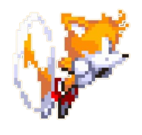

# Miles Prower Workshop

Welcome to Miles Prower's Workshop! (Call it Tails' workshop for short :P)

This repository is my personal coding environment in VSCode, designed for competitive programming contests. 

> **NOTE:** Don't forget to create `input.txt` next to `main.cpp`

Inspired by the mechanic genius famously known as **Tails the fox**, this workshop is all about speed, precision, and innovation.

Get ready to code at sonic's speed and reach new heights with ease!

*created and maintained by LaithSaq* •︿•
